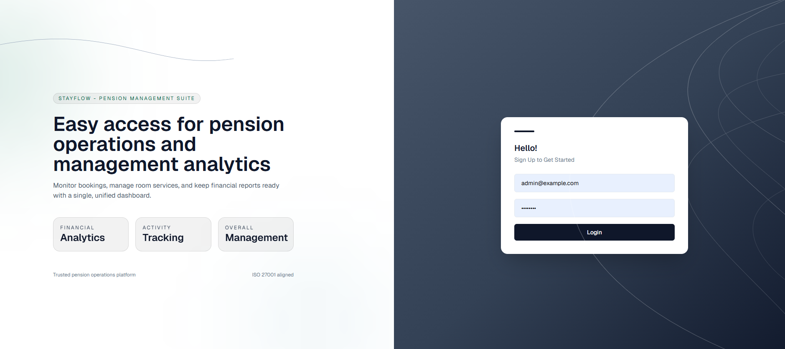
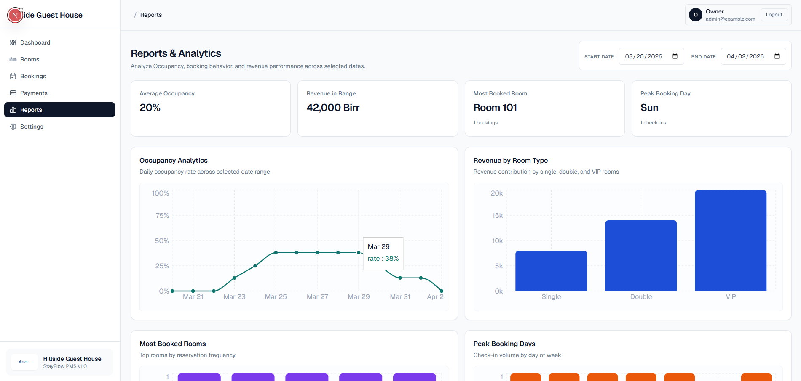

# Pension Management System

This project is a monorepo for a guest-house/pension management platform. It includes a Next.js dashboard for operations and a NestJS API for bookings, rooms, payments, and reporting.

## Key Features

- Room and booking management with status tracking
- Payments and reporting views
- Role-based access (admin/staff)
- Operational dashboards and calendar views
- Shared contracts and types across frontend and backend

## Tech Stack

- Next.js 16 (App Router) and React 19
- NestJS 11 API
- Drizzle ORM with Postgres/Neon
- TanStack Query and Tailwind CSS
- Turborepo + pnpm workspaces

## Screenshots




## Repository Layout

- [apps/web](apps/web): Next.js dashboard
- [apps/nest-back](apps/nest-back): NestJS API
- [packages/db](packages/db): Drizzle schema and DB helpers
- [packages/contracts](packages/contracts): Shared API contracts (Zod)
- [packages/types](packages/types): Shared type definitions
- [packages/ui](packages/ui): Shared UI components
- [packages/eslint-config](packages/eslint-config): ESLint rules
- [packages/typescript-config](packages/typescript-config): Base TS configs

## Getting Started

### Prerequisites

- Node.js >= 18
- pnpm 9
- Postgres (local) or Neon

### Install

```bash
pnpm install
```

### Environment Variables

Create a `.env` at the repo root, web( frontend directory ) and the nest-back( the api directory). And here are the minimum variables in each:

```bash
# Backend (Nest js api)
PORT=5000
JWT_SECRET= 'write your secret here'
FRONTEND_URL=http://localhost:3001
NODE_ENV=development

# Workspace .env file ( root env)
NEON_DATABASE_URL= 'your neon url here'
DATABASE_URL = 'your local db url here'
DB_PROVIDER=neon

# Web
API_URL=http://localhost:5000/
NEXT_PUBLIC_API_URL=http://localhost:5000/
```

Notes:

- If `DB_PROVIDER` is not set, Neon is selected when `NEON_DATABASE_URL` is present; otherwise local Postgres is used.
- `JWT_SECRET` defaults to `dev-secret` if not provided (set it in production).

### Run the Stack

Run everything with Turborepo:

```bash
pnpm dev
```

Or run apps individually:

```bash
pnpm --filter nest-back dev
pnpm --filter web dev
```

The web app runs on `http://localhost:3000` by default. The API runs on `http://localhost:5000` unless `PORT` is set.

## Database

Drizzle config lives in [packages/db](packages/db) and reads connection settings from the root `.env`. Migrations are stored in `packages/db/drizzle`.

### Seed Data

The API provides a seed script with default users:

```bash
pnpm --filter nest-back seed
```

Default users are defined in [apps/nest-back/src/seed.ts](apps/nest-back/src/seed.ts).

## Common Scripts

From the repo root:

```bash
pnpm dev
pnpm build
pnpm lint
pnpm test
pnpm check-types
pnpm format
```

From a specific app or package:

```bash
pnpm --filter web dev
pnpm --filter nest-back dev
pnpm --filter @repo/db check-types
```

## Authentication

The API uses HTTP-only cookies (`access_token`) for sessions. The web app consumes the API via `NEXT_PUBLIC_API_URL` with `credentials: include`.

## License

Private repository. All rights reserved.
