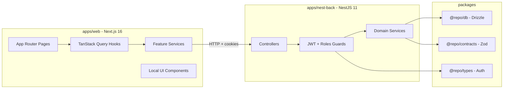
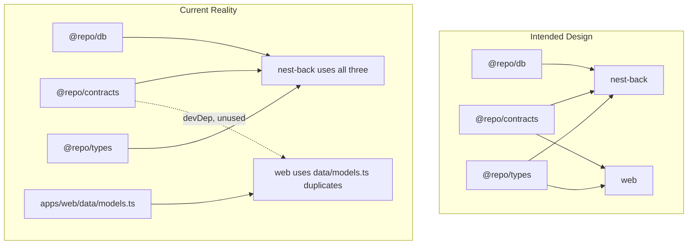
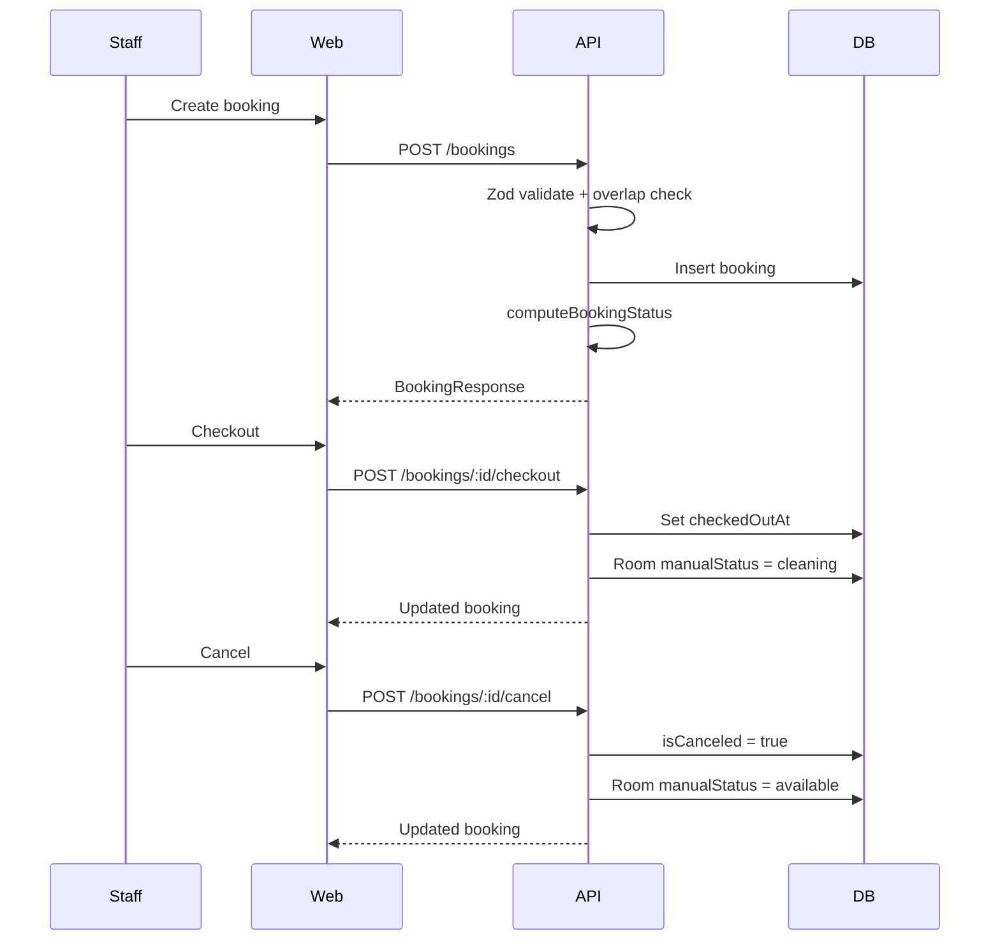

# StayFlow — Project Analysis

> Full-stack Pension / Guesthouse Management System for small to medium-sized hotels, pensions, and guesthouses.

## Overview

StayFlow is a **full-stack pension/guesthouse PMS** built as a Turborepo monorepo. It focuses on real reception-desk workflows: rooms, bookings, payments visibility, dashboards, reports, and admin settings — with **admin/staff RBAC**.

### Tech Stack

- **Frontend:** Next.js 16 (App Router), React 19, TanStack Query, Tailwind CSS, Recharts
- **Backend:** NestJS 11, JWT auth with httpOnly cookies
- **Database:** PostgreSQL (Neon or local) with Drizzle ORM
- **Monorepo:** Turborepo + pnpm workspaces
- **Validation:** Zod (shared contracts package)
- **Language:** TypeScript throughout

---

## Architecture



---

## Monorepo Structure

| Path | Role |
|------|------|
| `apps/web` | Next.js 16 dashboard (port **3001** via dev script; README says 3000) |
| `apps/nest-back` | NestJS REST API (port **5000**) |
| `packages/db` | Drizzle schema, migrations, DB client (Neon or local Postgres) |
| `packages/contracts` | Zod schemas + inferred API DTO types |
| `packages/types` | Auth-only TS types (`Role`, `User`) |
| `packages/ui` | Turborepo starter — **unused** by web app |
| `packages/eslint-config` | Shared ESLint configs |
| `packages/typescript-config` | Shared TS configs |

**Dev:** `pnpm dev` runs Turbo across all packages with dev scripts.

**CI:** `.github/workflows/ci.yaml` — install, build, test on `main`.

---

## Domain Model

Five PostgreSQL tables in `packages/db/src/schema.ts`:

```mermaid
erDiagram
    users ||--o{ : "auth only"
    rooms ||--o{ bookings : roomId
    rooms ||--o{ payments : roomId
    bookings ||--o{ payments : bookingId
    settings : "singleton id=main"

    users { uuid id PK, text email, text password, enum role }
    rooms { text id PK, text number UK, enum type, enum manualStatus, int pricePerNight }
    bookings { text id PK, text code UK, text roomId FK, guest fields, dates, paidAmount, isCanceled }
    payments { text id PK, text bookingId FK, int amount, enum method, enum status }
    settings { text id PK, pension info, pricing, operational flags }
```

### Key Business Rules

- **`operationDay`** (`YYYY-MM-DD`): drives "today" for status, occupancy, and dashboard metrics.
- **Booking status** is **computed**, not stored — via `apps/nest-back/src/bookings/booking-status.ts`: `canceled` → `checked_out` → `upcoming` → `active`.
- **Room effective status** is derived: `maintenance` > `occupied` (active booking) > `cleaning` > `available`.
- **Overlap prevention** on create/update; cancel frees room; checkout marks room `cleaning` (unless maintenance).
- **Pricing:** `totalAmount = pricePerNight × nights`; `paidAmount` capped at total; payment status derived (`unpaid | partial | paid`).
- **Settings** singleton row `id = 'main'` with get-or-create defaults.

---

## Backend Architecture (`apps/nest-back`)

### Modules & Endpoints

| Module | Routes | Roles |
|--------|--------|-------|
| Auth | `POST /auth/register`, `/login`, `/logout`; `GET /auth/me` | Public + JWT |
| Rooms | CRUD + `/available` + status patch | Staff read/update status; **admin** create/edit |
| Bookings | List, create, update, cancel, checkout | admin + staff |
| Payments | List, summary, trends | admin + staff (**read-only**) |
| Dashboard | Summary + 7-day trends | admin + staff |
| Reports | Analytics with date range | **admin only** |
| Settings | Pension info, pricing, operational prefs | **admin only** |

### Auth Pattern

- JWT payload: `{ userId, role }` in **httpOnly `access_token` cookie** (7-day cookie, 1-day JWT expiry).
- `jwt-auth.guard.ts`: cookie-only (no Bearer header).
- `roles.guard.ts`: `admin` bypasses all; `staff` needs explicit `@Roles('staff')`.
- CORS with credentials; cookie `sameSite`/`secure` varies by env.

### Data Access Pattern

- Services import singleton `db` from `@repo/db` directly (no Nest DB module).
- **Most list endpoints:** load full table → filter/sort/paginate **in memory**.
- **Reports:** raw SQL with `generate_series` via Drizzle `db.execute`.
- Validation: mixed — Zod via `@repo/contracts` in some services, hand-rolled parsers in others (rooms create/update, settings, parts of bookings list query).

### Seed Data

`apps/nest-back/src/seed.ts` provides:

- Users: `admin@example.com` / `staff@example.com`
- Sample rooms, bookings, payments, and settings

---

## Frontend Architecture (`apps/web`)

### Routing

| Route | Feature | Access |
|-------|---------|--------|
| `/auth/login` | Login | Public |
| `/dashboard` | KPIs, charts, recent bookings | Authenticated |
| `/rooms`, `/rooms/[id]` | List + detail + calendar | Authenticated |
| `/bookings` | Table + calendar + CRUD drawer | Authenticated |
| `/payments` | Summary, trends, table | Authenticated |
| `/reports` | Date-range analytics | **Admin** |
| `/settings` | Pension config | **Admin** |

Each dashboard route has a `loading.tsx` skeleton.

### Architecture Pattern

```
Page (thin) → *Management component → hooks (TanStack Query) → services (apiFetch) → API
```

- **Auth:** `auth-provider.tsx` restores session via `GET /auth/me`; login sets query cache directly.
- **Route protection:** `middleware.ts` checks cookie **only in development**; production relies on client auth + API 401 redirect.
- **Role UI:** nav hides Reports/Settings for staff; admin pages redirect non-admins; room edit/revenue hidden from staff.
- **URL-synced filters:** rooms, bookings, payments sync pagination/filters to search params.
- **Local UI library:** `apps/web/components/ui/` — `DataTable`, `FormSurface`, `MetricCard`, charts, badges (not `@repo/ui`).
- **Custom calendars:** month grids in bookings and room detail (no react-day-picker usage despite dependency).

### API Client

`apps/web/lib/api-client.ts`: `credentials: "include"`, 401 → redirect to `/auth/login`.

---

## Shared Contracts — Intended vs Actual



**Frontend type drift example** — `apps/web/data/models.ts` adds extra booking statuses (`confirmed`, `pending`, `cancelled`) not in contracts.

**Backend validation gaps:**

- Room create/update Zod schemas exist but rooms service uses manual parsers.
- Bookings list query not using `listBookingsQuerySchema`.
- Settings and reports have no shared Zod contracts.
- Auth `registerSchema.parse()` throws raw `ZodError` instead of `BadRequestException`.
- No global Nest `ValidationPipe` or exception filter.

---

## Booking Lifecycle Data Flow



---

## Strengths

1. **Clear domain focus** — practical PMS workflows, not enterprise bloat.
2. **Solid monorepo split** — DB, contracts, types as separate packages with Turbo build ordering.
3. **Real operational logic** — booking lifecycle, room occupancy derivation, conflict prevention, checkout → cleaning.
4. **Polished frontend UX** — loading states, drawers with dirty-close protection, URL-synced filters, role-aware UI, custom calendars.
5. **Security basics** — httpOnly cookies, bcrypt, RBAC guards, CORS credentials.
6. **Feature-complete dashboard** — metrics, charts (Recharts), reports with SQL analytics.

---

## Gaps & Technical Debt

### Feature Gaps

| Gap | Detail |
|-----|--------|
| **Payment recording** | `payments` table is seeded/read-only; no API to record new payments. Booking `paidAmount` is the only mutable payment field. |
| **Operational settings not enforced** | Settings flags (`requireIdBeforeCheckIn`, `allowWalkInBookings`, etc.) stored but not validated in booking/room services. |
| **No user management UI** | Register endpoint exists; no admin UI to manage staff accounts. |
| **Legacy OperationsProvider** | `operations-provider.tsx` still holds seed data; most features hit API but `operationDay` comes from this provider. |
| **Production auth middleware** | Disabled in prod — relies entirely on client-side checks. |

### Quality Gaps

| Gap | Detail |
|-----|--------|
| **Frontend not using shared contracts** | Types duplicated in `data/models.ts`; no runtime Zod validation on client. |
| **Inconsistent backend validation** | Partial Zod adoption; duplicated `parseSchema()` helpers across services. |
| **Enum duplication** | Same enums in schema, contracts, and frontend separately. |
| **In-memory pagination** | Won't scale beyond small datasets (acceptable for target market, but worth noting). |
| **Minimal test coverage** | Only Nest e2e + module spec; no frontend tests. |
| **Unused packages** | `@repo/ui` scaffold; `react-day-picker` in web deps unused. |
| **JWT/cookie expiry mismatch** | Cookie 7 days vs JWT 1 day — session may appear valid but API rejects. |

---

## Environment & Deployment

- **Env files:** root `.env` (DB), `apps/nest-back/.env` (JWT, CORS, PORT), `apps/web/.env` (`NEXT_PUBLIC_API_URL`).
- **DB provider:** auto-selects Neon if `NEON_DATABASE_URL` set; else local Postgres.
- **Not yet configured:** production deployment targets, cookie domain for cross-origin prod, production middleware strategy.

---

## Recommended Next Steps

### Quality (foundation first)

1. Wire frontend to `@repo/contracts` types (replace `data/models.ts` duplicates).
2. Complete backend Zod adoption + extract shared `parseSchema` helper.
3. Add Zod contracts for settings/reports.
4. Fix JWT/cookie expiry alignment.
5. Enable production route protection (middleware or server-side auth check).

### Features (build on quality)

1. **Payment recording API + UI** — POST payments, sync with booking `paidAmount`.
2. **Enforce operational settings** — validate booking create against settings flags.
3. **Staff user management** — admin UI for creating/managing staff accounts.
4. **Remove OperationsProvider legacy** — derive `operationDay` from a single source (API or client date).
