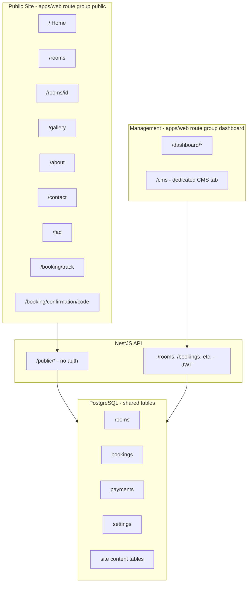
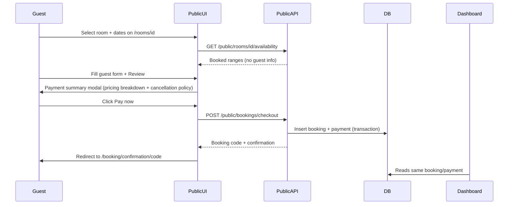

# StayFlow — Public Guest Site & Booking Engine (Scope)

## Overview

Add a public-facing guesthouse showcase and booking engine at `/`, backed by new public API endpoints and a dedicated mobile-first CMS tab (separate from Settings) for page-by-page content management, with instant simulated payments that sync across the entire management system.

---

## Current State

- `apps/web/app/page.tsx` redirects `/` → `/dashboard` — no public presence.
- All room/booking/payment APIs require JWT (`apps/nest-back/src/rooms/rooms.controller.ts`).
- `middleware.ts` blocks **every route** without a cookie in dev (except login) — public pages cannot work until fixed.
- Booking `source` enum already includes `"website"` — ready for public bookings.
- Settings already store pension name, contact, address, city — usable for Contact/Maps/Call buttons.
- **Missing today:** site content tables (gallery, amenities, FAQ, attractions), public API, payment creation API, guest booking lookup.

---

## Confirmed Decisions

| Decision | Choice |
|----------|--------|
| Site content | Dedicated CMS tab (separate from Settings), page-classified, mobile-first, stored in DB |
| Post-booking UX | Confirmation page + "Track my booking" lookup (code + phone/email) |
| Booking model | Instantly confirmed on simulated "Pay now" |

---

## High-Level Architecture

**Single source of truth:** Public and management sides read/write the same `rooms`, `bookings`, `payments`, and `settings` tables. A website booking with simulated payment appears immediately in dashboard, rooms, bookings, payments, and reports — no duplicate data.

---

## Route Structure (Next.js)

| Route | Purpose |
|-------|---------|
| `/` | Premium home page (hero, featured rooms, CTA) |
| `/rooms` | Browse all bookable rooms |
| `/rooms/[id]` | Room detail, availability calendar, Book + Call buttons |
| `/gallery` | Photo gallery from CMS content |
| `/about` | Pension story + owner info |
| `/amenities` | Amenities list from CMS content |
| `/attractions` | Nearby attractions from CMS content |
| `/contact` | Contact info, map, call button |
| `/faq` | FAQ accordion from CMS content |
| `/terms` | Terms of service (CMS-driven or static) |
| `/privacy` | Privacy policy (CMS-driven or static) |
| `/booking/confirmation/[code]` | Post-payment confirmation with booking details |
| `/booking/track` | Lookup booking status by code + phone/email |
| `/dashboard/*` | Existing management app (unchanged paths) |
| `/cms` | Dedicated CMS — mobile-first public site content editor (admin only) |
| `/auth/login` | Staff/admin login (unchanged) |

**Layout split:**
- `(public)/layout.tsx` — marketing header with nav tabs, footer (Terms + Privacy links), animations
- `(dashboard)/layout.tsx` — existing operational shell

**Middleware:** Protect `/dashboard`, `/cms`, and admin paths — all `(public)` routes pass without cookie.

**Management nav:** Add **Website (CMS)** as a top-level sidebar item in `apps/web/lib/navigation.ts` — admin only, separate from Settings.

---

## Database Changes

### 1. New `site_config` table (CMS global — NOT in Settings)

Singleton row (`id = 'main'`):

- `tagline`, `heroImageUrl`, `heroHeadline`, `heroSubtext`
- `aboutDescription`, `cancellationPolicy`, `termsText`, `privacyText`
- `mapEmbedUrl`, `mapLat`, `mapLng`
- `allowOnlineBookings` (integer 0/1, default 1)
- `contactPhone`, `contactEmail`, `address`, `city`, `pensionName`

Operational settings (pricing, walk-in toggles, check-in/out times) **stay in Settings**. CMS reads check-in/out for public display but does not edit them.

### 2. Page-classified site content tables

| Table | CMS Page | Fields |
|-------|----------|--------|
| `site_gallery_items` | Gallery | id, imageUrl, caption, sortOrder, createdAt |
| `site_amenities` | Amenities | id, name, icon, description, sortOrder |
| `site_faqs` | FAQ | id, question, answer, sortOrder |
| `site_attractions` | Attractions | id, name, description, distance, imageUrl, sortOrder |
| `site_page_content` | Home, Rooms, About, Contact | pageSlug, sectionKey, content (JSON/text), sortOrder |

### 3. Payment method enum extension

Add `"online"` to `paymentMethodEnum` — used for simulated web payments.

---

## Backend — `PublicModule` + `CmsModule`

### `PublicModule` — `apps/nest-back/src/public/` (no JWT)

| Endpoint | Returns |
|----------|---------|
| `GET /public/pension` | Name, tagline, contact, address, city, check-in/out times, call/email |
| `GET /public/site-content` | All page content assembled from CMS |
| `GET /public/rooms` | Bookable rooms only (exclude `maintenance`); no `currentGuest` |
| `GET /public/rooms/:id` | Room detail + sanitized fields |
| `GET /public/rooms/:id/availability?from=&to=` | Future/present booked date ranges only — no guest PII |
| `POST /public/bookings/checkout` | Atomic booking + payment (`source: "website"`, `method: "online"`) |
| `GET /public/bookings/lookup?code=&contact=` | Lookup by code + phone/email — 404 on mismatch |

**Business rules:**
- Reject if `allowOnlineBookings` is off
- Reject rooms in `maintenance`
- Overlap check inside DB transaction
- Availability: exclude past, canceled, and checked-out bookings
- Minimum advance booking rule (e.g. no same-day check-in after 6pm) — configurable
- Rate limit public write endpoints per IP

### `CmsModule` — `apps/nest-back/src/cms/` (admin JWT only)

| Endpoint | Purpose |
|----------|---------|
| `GET /cms/pages` | List CMS pages with completion status |
| `GET /cms/pages/:slug` | All editable content for one page |
| `PATCH /cms/pages/:slug` | Save page content |
| `GET/PATCH /cms/global` | Site-wide config, cancellation policy, terms, privacy, map |
| CRUD `/cms/gallery`, `/cms/amenities`, `/cms/faqs`, `/cms/attractions` | Entity management |

---

## Booking Flow (Public)

**Modal (pre-pay):** room name, dates, nights, rate/night, total breakdown, guest name, check-in/out times, cancellation policy.

**"Pay now" (simulated):** no external provider — marks booking fully paid in one atomic call.

**Confirmation page:** prominent booking reference code, honest "email confirmation coming soon" message, link to Track my booking.

---

## Dedicated CMS — `/cms` (admin only)

Mobile-first CMS, separate from Settings. Page-classified editors:

| CMS Page | Editable content |
|----------|------------------|
| **Global** | Tagline, hero defaults, allow online bookings, cancellation policy, terms, privacy, Google Maps embed |
| **Home** | Hero headline/subtext, hero image, featured rooms, intro/CTA copy |
| **Rooms** | Page headline, intro text (room inventory still from `/rooms`) |
| **Gallery** | Add/remove/reorder photos with captions |
| **About** | Story text, owner bio, images |
| **Amenities** | Add/remove/reorder amenities |
| **Attractions** | Add/remove/reorder nearby places |
| **Contact** | Contact page copy, map, phone/email/address display |
| **FAQ** | Add/remove/reorder Q&A pairs |

- **Mobile:** bottom tab bar page picker
- **Desktop:** sidebar + editor panel
- **Live preview link** per page

Settings page stays unchanged — operational config only.

---

## Credibility Requirements (Must-Have + Strongly Recommended)

All items below are **explicitly scheduled in implementation phases**.

### Must-have (v1)

| # | Requirement | Phase |
|---|-------------|-------|
| 1 | Booking reference code prominently on confirmation page | Phase 3 |
| 2 | Track my booking page (code + phone/email verification) | Phase 2 (API) + Phase 3 (UI) |
| 3 | Transparent pricing breakdown (rate × nights = total) before Pay now | Phase 3 |
| 4 | Check-in/check-out times from Settings on room + confirmation pages | Phase 3 |
| 5 | Real contact info from CMS (phone, email, address — no placeholders) | Phase 3 + Phase 4 |
| 6 | Google Maps embed on Contact page from CMS config | Phase 3 + Phase 4 |
| 7 | Cancellation policy shown in booking modal + editable in CMS Global | Phase 3 + Phase 4 |
| 8 | Maintenance rooms not bookable (server-side enforcement) | Phase 2 |
| 9 | Privacy on calendar — "Booked" blocks only, never guest names | Phase 2 + Phase 3 |

### Strongly recommended (v1)

| # | Requirement | Phase |
|---|-------------|-------|
| 10 | Terms & Privacy footer links → `/terms` and `/privacy` pages | Phase 3 (pages) + Phase 4 (CMS Global editor) |
| 11 | Dual booking paths — "Book online" + "Call to book" (`tel:` link) on room pages | Phase 3 |
| 12 | Booking source badge in management bookings table | Phase 5 |
| 13 | Honest post-booking messaging — "Confirmation saved — email coming soon" | Phase 3 |
| 14 | Minimum advance booking rule (e.g. no same-day after 6pm) | Phase 2 |

### Do NOT do

- Fake reviews or stock testimonial names
- Fake urgency ("Only 1 room left!")
- Placeholder lorem ipsum in production content
- Expose other guests' personal details on public site

### Future (post v1 — mention honestly in UI where relevant)

- Real payment provider (Chapa, Stripe, etc.)
- Email/SMS notifications
- Guest accounts / login
- Multi-language support

---

## Implementation Phases

### Phase 1 — Foundation (backend + routing)

- [x] DB migration: `site_config`, page content tables, entity tables + `online` payment method
- [x] `PublicModule` with read endpoints; `CmsModule` scaffold (admin-only)
- Middleware fix: public route allowlist + protect `/cms`
- Move `/` to public home; dashboard stays at `/dashboard`
- Add **Website (CMS)** nav item (admin only)

### Phase 2 — Booking engine + credibility rules

- Availability endpoint — sanitized, future/present only, no guest PII (**#8, #9**)
- Reject maintenance rooms server-side (**#8**)
- Minimum advance booking rule (**#14**)
- `POST /public/bookings/checkout` — atomic booking + payment with overlap check in transaction
- `GET /public/bookings/lookup` — code + phone/email, 404 on mismatch (**#2**)
- Rate limiting on public write endpoints
- Zod contracts: `public.ts`, `site-content.ts`, `cms.ts`

### Phase 3 — Public frontend + booking UX

- `(public)` layout with footer Terms + Privacy links (**#10**)
- All public pages: home, rooms, detail, gallery, about, amenities, attractions, contact, faq
- `/terms` and `/privacy` pages (**#10**)
- Room detail: availability calendar (**#9**), Book + Call buttons (**#11**)
- Booking modal: transparent pricing breakdown (**#3**), check-in/out times (**#4**), cancellation policy (**#7**)
- Payment summary → simulated Pay now → redirect to confirmation
- Confirmation page: prominent booking code (**#1**), booking summary, honest email messaging (**#13**), link to Track my booking
- Track my booking page (**#2**)
- Real contact info + Google Maps on Contact page (**#5, #6**)
- Public pages consume `GET /public/site-content` + `GET /public/pension`
- Animations (`framer-motion`), mobile-first nav, sticky Book CTA

### Phase 4 — Dedicated CMS (mobile-first, page-classified)

- CMS shell: mobile bottom-nav + desktop sidebar
- Per-page editors: Global, Home, Rooms, Gallery, About, Amenities, Attractions, Contact, FAQ
- Global page: cancellation policy, terms, privacy, map embed, allow online bookings (**#7, #10**)
- Contact page editor: phone, email, address display (**#5, #6**)
- `CmsModule` full CRUD wired to all CMS pages
- Live preview links per page
- Seed script: sample CMS content for all pages (no lorem ipsum placeholders)

### Phase 5 — Management integration + polish + testing

- Payment creation service (shared foundation)
- Bookings table: source badge for website vs walk-in vs phone vs agent (**#12**)
- Fix staff booking form: default `source: "walk-in"`, allow source selection
- Full dashboard sync verification: rooms, bookings, payments, dashboard, reports
- E2E tests:
  - CMS edit → public page reflects change
  - Public book + Pay now → visible across all management views
  - Track my booking lookup works with code + contact
- Performance: Server Components for static pages, loading states

---

## Data Sync Guarantees

| Management view | Sync mechanism |
|-----------------|----------------|
| `/rooms` | Same `rooms` table; occupancy derived from new booking |
| `/rooms/[id]` | Room detail + calendar reflects new booking |
| `/bookings` | New row with `source: "website"` |
| `/payments` | New payment row with `method: "online"` |
| `/dashboard` | Summary/trends include new revenue + occupancy |
| `/reports` | Analytics include website bookings in date range |

---

## Key Files

| Area | Files |
|------|-------|
| DB | `packages/db/src/schema.ts`, migration, `packages/contracts/src/public.ts`, `site-content.ts`, `cms.ts` |
| API | `apps/nest-back/src/public/*`, `apps/nest-back/src/cms/*`, `payments/*` |
| Web public | `apps/web/app/(public)/**`, `apps/web/components/public/**` |
| Web CMS | `apps/web/app/(dashboard)/cms/**`, `apps/web/components/cms/**` |
| Nav | `apps/web/lib/navigation.ts` |
| Config | `apps/web/middleware.ts`, `apps/web/app/page.tsx` |

---

## Risk Notes

| Risk | Mitigation |
|------|------------|
| Double-booking race condition | DB transaction + overlap check; row-level lock on room |
| Dev middleware blocking public | Explicit public path allowlist |
| Guest PII leak | Separate public DTOs; never expose guest names on availability |
| Type drift | Wire public frontend to `@repo/contracts` from the start |
| Credibility gaps | All 14 must-have + recommended items mapped to phases above |

---

## Implementation Checklist

- [ ] Phase 1 — Foundation (backend + routing)
- [ ] Phase 2 — Booking engine + credibility rules
- [ ] Phase 3 — Public frontend + booking UX
- [ ] Phase 4 — Dedicated CMS
- [ ] Phase 5 — Management integration + polish + testing
